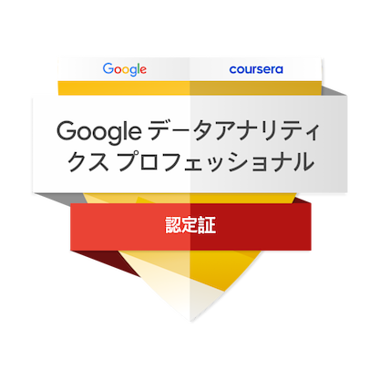

# Portfolio

## 取り組んだ分析課題
### 機械学習を用いた分類
結果をStreamlitでアプリ化し、ROC AUCスコアが0.81で、再現率と適合率が比較的高いモデルを構築しました。また、特徴量の重要度をSHAP分析を用いて可視化しました。 
  
<a href="https://portfoliotitanic-gj5ulajyurszafogejxgzl.streamlit.app/" target="_blank">機械学習を用いたタイタニック号乗客の生存確率分析</a>  
  
<a href="https://www.kaggle.com/code/yuukiiwakura/classifier-by-catboost" target="_blank">Kaggle分析ノートブック</a> 

## 機械学習を用いた回帰
https://portfoliohouseprice-fo9ulyssetjkjiappnpywxw.streamlit.app/  
### 分析ノート 
https://www.kaggle.com/code/yuukiiwakura/regressoin-by-lightgbm  

## ニューラルネットワークを用いた画像分類
https://portfoliodogscats-hbvehhzihycnxdplnrxzu4.streamlit.app/  
### 分析ノート
https://www.kaggle.com/code/yuukiiwakura/2-class-classification-using-pytorch-original-cnn  

## 転移学習を用いた画像分類
https://flowerclassification-mudkpi47dcealenst7iynq.streamlit.app/  
### 分析ノート
https://www.kaggle.com/code/yuukiiwakura/5-class-classification-using-pytorch-densenet  

## YOLOv8を用いた物体検出
https://helmetv2-jipzd9znb5yip8xmza8wfu.streamlit.app/  
下記のurlから動画検出も含めたアプリに飛べますが、環境によっては動画が再生されない可能性があります。  
因みに、windowsのブラウザでは動画を再生できませんでした。一方で、iphone環境では動画を再生することができました。  
アプリで動画を確認できない方は分析結果報告スライドのfig06を確認ください。  
https://helmetv2-kppnytbjth5qe8udrcjohh.streamlit.app/  
### 分析結果報告スライド
https://docs.google.com/presentation/d/1tLZ4_f5EMZsqNUVD2tdCjxSMs35r3YLRnNA95BSTrb0/edit#slide=id.p

## Bertモデルを用いた自然言語処理
### 分析ノート
https://www.kaggle.com/code/yuukiiwakura/fine-tuning-bert-with-peft-for-text-classification/edit

## GoogleDataAnalyticsProfessional認定ケーススタディ
### 分析結果報告スライド
https://docs.google.com/presentation/d/1yJ9RSdGBTQlT9GvQKLMHq5cAHBwVKtG39ImytjGriBU/edit#slide=id.p
### 分析ノート
https://www.kaggle.com/code/yuukiiwakura/casestudy  
### 認定バッジ

<!--
**gan0606/gan0606** is a ✨ _special_ ✨ repository because its `README.md` (this file) appears on your GitHub profile.

Here are some ideas to get you started:

- 🔭 I’m currently working on ...
- 🌱 I’m currently learning ...
- 👯 I’m looking to collaborate on ...
- 🤔 I’m looking for help with ...
- 💬 Ask me about ...
- 📫 How to reach me: ...
- 😄 Pronouns: ...
- ⚡ Fun fact: ...
-->
